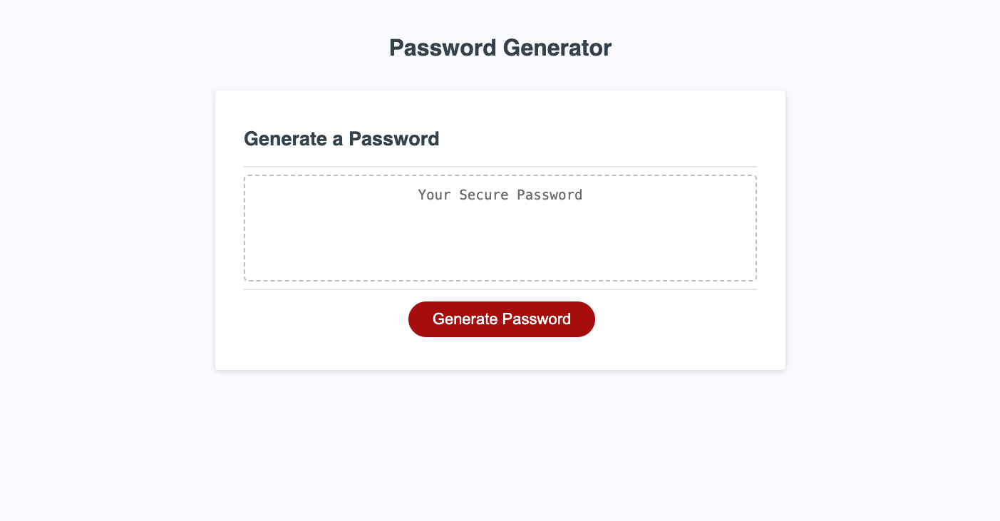
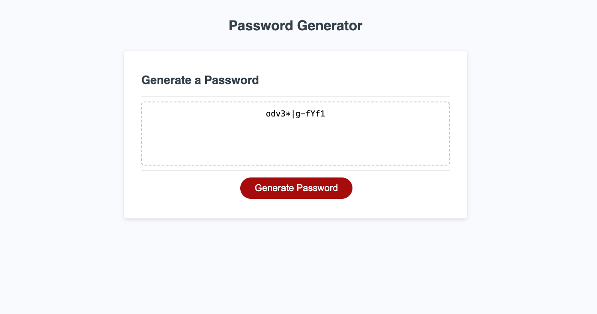

# Password Generator 

[Visit Deployed Site](https://abenedetti27.github.io/password-generator/)

[](https://opensource.org/licenses/MIT)

## Description <a name="description"></a>

This is an app to randomly generate a password that meets certain criteria so that the user can create a strong password that provides greater security.

## Table of Countents 
- [Description](#description)
- [Installation](#installation)
- [Usage](#usage)
- [License](#license)
- [Questions](#questions)

## Installation <a name="installation"></a>
When the user clicks the button to generate a password, they are presented with a series of prompts for password criteria.
They can select which criteria to include in the password and the length of the password. The user must choose a length of at least 8 characters and no more than 128 characters. When asked for character types to include in the password,
the user can confirm whether or not to include lowercase, uppercase, numeric, and/or special characters.

After each prompt is answered, the input will be validated and at least one character type will be selected. When all prompts are answered, a password is generated that matches the selected criteria and is displayed on the page. 






Project Card
```
var generateBtn = document.querySelector("#generate");

// Write password to the #password input
function writePassword() {
  function generatePassword() {
    const lowerCase = "abcdefghijklmnopqrstuvwxyz";
    const upperCase = "ABCDEFGHIJKLMNOPQRSTUVWXYZ";
    const numbers = "0123456789";
    const symbols = "!@#$%^&*()_+~`|}{[]:;?><,./-=";

    let passwordLength;

    // Prompt for password length until a valid input is received
    do {
      passwordLength = parseInt(prompt("Enter password length (between 8 and 128 characters)"));

      if (isNaN(passwordLength) || passwordLength < 8 || passwordLength > 128) {
        alert("Please enter a valid password length between 8 and 128 characters.");
      }
    } while (isNaN(passwordLength) || passwordLength < 8 || passwordLength > 128);

    let includeLowerCase, includeUpperCase, includeNumbers, includeSymbols;

    // Prompt for character types until at least one type is selected
    do {
      includeLowerCase = confirm("Include lowercase characters?");
      includeUpperCase = confirm("Include uppercase characters?");
      includeNumbers = confirm("Include numbers?");
      includeSymbols = confirm("Include symbols?");

      if (!(includeLowerCase || includeUpperCase || includeNumbers || includeSymbols)) {
        alert("Please select at least one character type.");
      }
    } while (!(includeLowerCase || includeUpperCase || includeNumbers || includeSymbols));


```

## Usage <a name="usage"></a>
This application is a  deployed React portfolio of web development work samples.


## License <a name="license"></a>
MIT License


## Questions <a name="questions"></a>

GitHub Profile: [github](https://github.com/abenedetti27)

Please direct any questions to:

Email: abenedetti27@gmail.com
